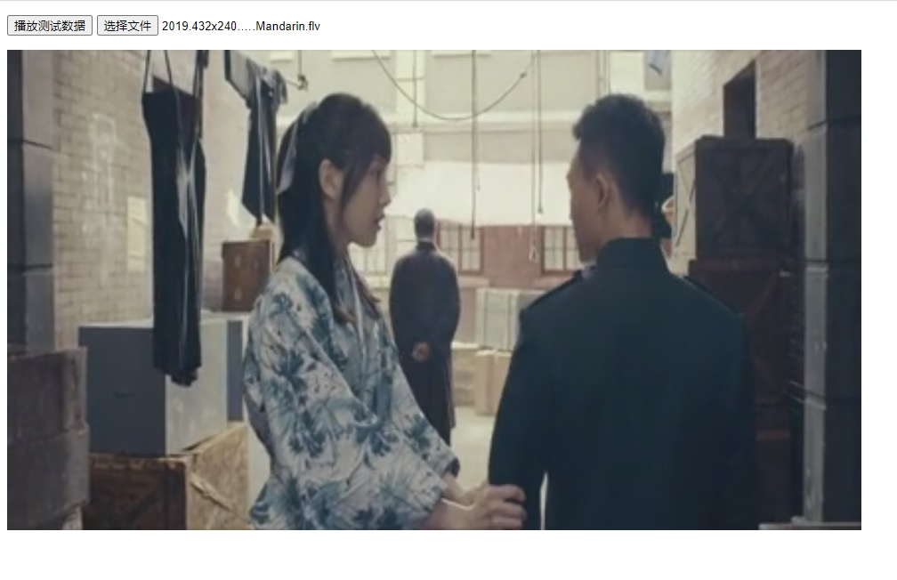

# ffdec.js

c, js, wasm, ffmpeg

基于wasm、ffmpeg读取视频文件并解码成YUV,供H5页面使用WebGL播放视频

```
Wasm文档:
https://emscripten.org/index.html

安装emcc:
https://emscripten.org/docs/getting_started/downloads.html

安装uglifyjs:
sudo npm install -g uglify-js
```

## 编译
```
cd ./ffdec.js
make
```

## 生成的模块文件
```
./ffdec.js/lib/ffdec-1.0.0.wasm
./ffdec.js/lib/ffdec-1.0.0.min.js
```

## 测试效果
```
http://127.0.0.1:8080/testffdec.html
```

## 使用流程简介
### Step1. 页面加载完成后,将模块指定为ffdecjs

```
$(document).ready(function(){
  var Module = ffdecjs
  ...
}
```

### Step2. 重写模块的"postRun"函数
* 此函数在模块初始化完成之后调用

```
ffdecjs.postRun = function() {
  ...
}
```

### Step3. 向浏览器"沙盒"文件系统(类unix)中写入视频文件
* ffmpeg支持的任何文件(例如:mp4,flv等)
* 写测试demo

```
ffdecjs.postRun = function() {
  FS.mkdir('/data');                          // 创建"/data"目录, 后面都向这个目录写文件  
  ffdecjs.write_test_file('/data/test.flv');  // 写测试demo文件

  ... //
}
```

* 通过"file"标签写任意文件
* 使用模块提供的"FS"接口写文件

````
var file0 = event.target.files[0];
if(!!file0){
  var reader = new FileReader();
  reader.readAsArrayBuffer(file0);
  reader.onload = function(){
    // TODO. 调整为分步读取数据, 写入文件, 避免一次读取过多的数据量
    var binary = new Uint8Array(this.result);
    //console.log("binary", binary);
    var stream = FS.open('/data/xxxx', 'w+');
    FS.write(stream, binary, 0, binary.length);
    FS.close(stream);
    //ffdecjs.print_file('/data/xxxx');
    //ffdecjs.open('/data/xxxx', '');
    ...
  }
}
````

* 测试是否写入文件成功

```
ffdecjs.print_file('/data/test.flv');
ffdecjs.print_file('/data/xxxx');
```

### Step4. 打开文件,并开始解码
* 需要给定的文件必须存在,并且是音视频文件

```
ffdecjs.open('/data/xxxx', '');
```

### Step5. 播放YUV数据
* 需要事先准备好WebGL环境, 可以参考"./ffdec.js/lib/testffdec.html"

```
setInterval(function(){
  var frame = ffdecjs.get_next_frame(); // 获取下一帧
  if (frame){
    //gl.viewport(x, y, width, height); // 这里根据图像宽高与显示区域宽高,调整输出图像位置
    draw_begin();
    draw_yuv(frame);
    draw_end();
  }
  //console.log("frame:", frame);
  // frame.time = 0x8000000000000000 为无效值
}, 33); // 可依据帧时间戳来控制播放节奏
```

## API
* 参见"./ffdec.js/src/libffdec.js"

```
/// @brief 打开待解码的文件
/// @param [in] *p_path_name  文件路径
/// @param [in] *p_param json 格式的参数信息
/// @return int 0.成功; 非0.错误码
ffdecjs.open = function(name/*string*/, param/*string*/){return true;}
```

```
/// @brief 关闭文件
/// @return int 0.成功
/// @note 关闭仅表示不再有数据被解码, 并不影响已经解码之后的数据
ffdecjs.close = function(){}
```

```
/// @brief 获取下一帧
/// @return {...}
ffdecjs.get_next_frame = function(){...; return frame;}

/// 返回YUV420P时
return = {
  w : 1920,                             // 图像宽
  h : 1080,                             // 图像高
  time : new Uint32Array([3000, 0]),    // 64位时间[低位,高位]: 0x8000000000000000为无效值

  otpye : 'YUV420P',                    // 图像数据格式
  pitch_y : 1920,                       // Y分量行跨距; 大于等于w
  pitch_u : 960,                        // U分量行跨距; 大于等于w/2
  pitch_v : 960,                        // V分量行跨距; 大于等于w/2
  y : new Uint8Array(pitch_y * h),      // Y数据
  u : new Uint8Array(pitch_u * h / 2),  // U数据
  v : new Uint8Array(pitch_v * h / 2),  // V数据
}

```

## 测试API

```
/// @brief 测试打印,是否加载成功
/// @param [in] n  数值
/// @return int 返回n
ffdecjs.hello = function(n/*number*/){return 0;}
```

```
/// @brief 写测试文件
/// @param [in] *p_path_name  文件路径名称: eg."/xxx.flv"
/// @return int 0.成功; 非0.错误码
///  把内置的测试flv数据写成文件
///  unix文件系统风格
ffdecjs.write_test_file = function(path_name/*string*/) {return 0;}
```

```
/// @brief 打印文件
/// @param [in] *p_path_name  文件路径名称: eg."/xxx.flv"
/// @return int 0.成功; 非0.错误码
///  unix文件系统风格
ffdecjs.print_file : function(path_name/*string*/) {return 0;}
```

## TODO
* 仅仅构建了初步效果

## Demo页面截图

